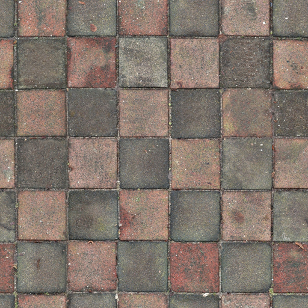

# Layout Calculator for GUI

## User Requirements

1. User has the abilty to set
    1. Scale (Pixel/Relative/Fit/Fill)
    2. Position (if not auto computed)
    3. Wrapping
    4. Layout type (Horizontal/Vertical/Grid)
    5. Alignment of objects inside the element
    6. Spacing inside the element
    7. Margins
    8. Padding
    9. Border
    10. Border radius
    11. Min & Max scale
    12. Custom Z index (if `2. Position` is not auto computed)
2. [GUI elements that support scroll bars](#objects-that-support-scrolling) have the ability to interact with the user via common manipulation techniques:
   1. Mouse scrolling up and down changes the sub-view the user can see from the bigger layout.
   2. Clicking outside the scrollbar's knob will scroll the view such that the mouse position is always in the middle of the knob's
        scale. [See Exception 1](#exceptions)
   3. Clicking and dragging the mouse up and down has the effect of changing the sub-view by the same amount the user has dragged.
        The mouse will not jump up and down in order to be located at the center of the knob's scale as in point 2. An offset from
        the knob's center and the mouse position shall be used instead.
3. User set scale actually represents the final element's scale which includes the margins the object. The whole element's area is used to position other elements of the same parent.
4. The inside content area of the element is shrunk by it's padding and borders. The content area is used to place child elements inside of the element.

## Exceptions
1. If knob position cannot be achieved (i.e. no more space to move the knob up or down), the closest distance to that ideal shall be used.

## General box model and definitions
### Box model
The box model used is comprised of the following, in order from outside to inside:
   1. Margins
   2. Borders
   3. Padding
   4. Actual content area

> **Note:** When the user sets the scale to be `(100, 100)` but he also has a margin of `(2, 2, 2, 2)` then this means that the actual, whole scale of the element is `user scale + margins` aka `(100 + 2ML + 2MR, 100 + 2MT + 2MB) = (104, 104)`

> **Note:** When the user sets the scale to be `(100, 100)` but he also has a padding of `(2, 2, 2, 2)` and a border size of `(4, 4, 4, 4)` then this means that the actual content area left is `user scale - padding - border size` aka `(100 - 2PL - 2PR - 4BL - 4BR, 100 - 2PT - 2PB - 4BT - 4BB) = (88, 88)`

### Definitions
`user scale` Refers to the user set preferred whole scale which includes margins.

> user scale = margins + borders + padding + content area

`user pos` Refers to the user set preferred element start position which includes margins.

> user pos = content area - borders - padding - margins

`computed scale` Refers to the scale that will be sent to the GPU for rendering. It does not contain the margins. This is what the layout calculator actually computes.

> computed scale = borders + padding + content area

`computed pos` Refers to the pos that the mesh that will be sent to GPU for rendering starts from. It does not contain the margins. This is what the layout calculator also computes.

> computed pos = content area - borders - padding

<!--  -->

## Objects that support scrolling